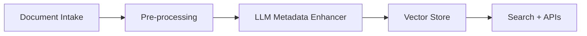

## Problem
Automate extraction and enrichment of unstructured documents across multiple business units with strict compliance and SLAs.

## Constraints
- Scalability across Azure/GCP/AWS
- PHI/PII compliance; auditability
- Throughput and latency targets for intake queues

## Approach
Composite AI/ML with event-driven microservices and durable orchestrations.

## Architecture
Containerized microservices, Apache Kafka, Azure Durable Functions, MongoDB, and observability with dashboards/alerts.

## Results
- **+25% accuracy** on entity extraction
- **99.9% uptime** across services
- **Onboarding time cut to seconds** with automation

## What I'd Do Next
Add active learning loop and human-in-the-loop review tooling.

